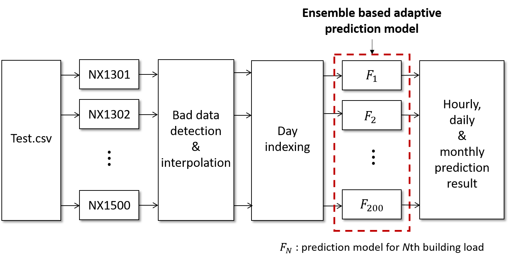
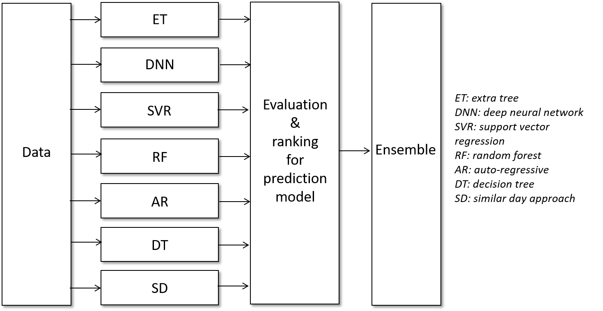
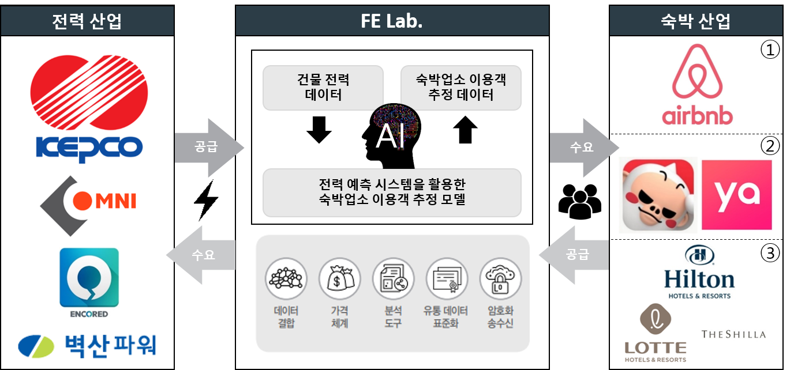
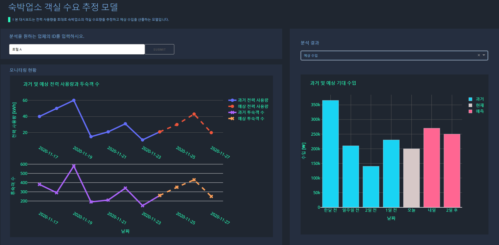
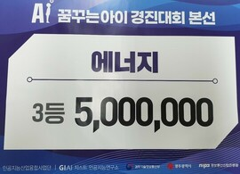

2020 Dream AI Open Challenge
=======================================
homepage: [link](https://dreamai.kr/fair_open)

### __Context__
* [Introduction](#introduction)
* [Proposed prediction model](#proposed-prediction-model)
* [Proposed business model](#proposed-business-model)
* [Prize](#prize)

### __Structure__
The structure of the project is as follows.
```setup
.
└── main.ipynb
└── parameters
└── gui
    └── app.py
└── business-simulation
    └── hotel-manipulation.py
    └── hotel-self-prediction.py
    └── power-data-augmentation.py
└── PPT
    └── round1.pdf
    └── round2.pdf
    └── round3.pdf
```
* main.ipynb: main file of the proposed load forecasting model
* parameters: parameters used in main file
* gui: gui for business product
* business-simulation: Virtual simulation to validate the effectiveness of the proposed business model
* PPT: 1, 2, 3round presentation files


Introduction
==================
### 1. Load forecasting
#### Objective
* Using historical power data, forecast future power consumption of buildings
* 200 residential + commercial buildings
    * hourly prediction: 2018-07-01 00~24
    * daily prediction: 2018-07-01 ~ 10
    * monthly prediction: 2018-07 ~ 11

#### Dataset
* Electricity consumption data of buildings in Korea
    * Train.csv: 1300 households, 2016-07-26 ~ 2018-06-30
    * Test.csv: 200 households, 2017-07-21 ~ 2018-06-30
* Sampling rate: 1 hour

#### Metric
Symmetric Mean Absolute Percentage Error (SMAPE)

### 2. Business model
Propose a business model for the proposed load forecasting model

Proposed prediction model
==================


###  1. Bad data detection & interpolation
* Nan detection for daily profile
    * If number of Nans is more than 4, remove it from training dataset
    * If not, apply spline interpolation

### 2. Day indexing
* split dataset in workday and non-workday
    * workday: weekday
    * non-workday: weekend and holiday

### 3. Ensemble based adaptive prediction model

* For each building load profile, apply 7 different models
* Based on smape result in validation set, assign ensemble weight for each models

### 4. Result
|Validation smape|Leaderboard private smape|  
|:------------:|:------------:|
|27.3%|26.9%|


Proposed business model
==================
### 1. Buseness model


* Power data-driven room demand forecasting and management solutions 
* that commercialize the power and lodging industries by linking them to data
* A business model that serves as a bridge between business content of leading companies in the power and lodging industries
* Building power data provided by the power industry is used as our proposed prediction system to process and provide it to property owners
* We expect to receive data through business connections with the property provider to advance the proposed model and demonstrate its usefulness in the power industry to generate additional revenue, such as funding

### 2. A Draft GUI solution


A draft solution to monitor and estimate property room demand
* Input: Company id looking for analysis
* Output 1: Historical and Estimated Power Usage, Number of Guests
* Output 2: Estimated income, etc. based on the estimated number of guests;

Prize
==================
* Round 1 (Technical solution): Private leaderboard: 1th
* Round 2 (Technical solution + Business model): 3th 
 



Contact
==================
If there is something wrong or you have any questions, send me an e-mail or make an issue.  
[](mailto:pond9816@gmail.com)